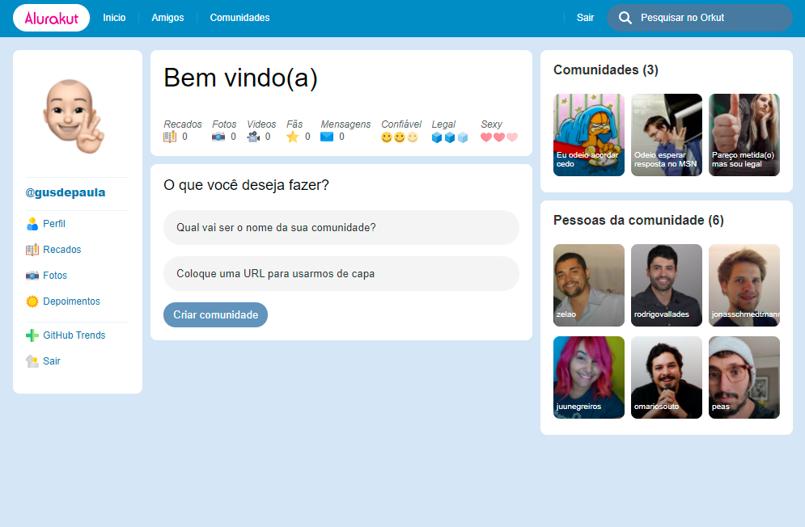

<div align="center">
	
</div>

## :dart: Objetivo

> Nesta terceira imersão React, a Alura prôpos a criação de uma aplicação para utilizar os conceitos do NextJS que vem ganhando muito espaço no mercado nos útimos dias e também a implementação do datoCMS. Sendo assim a ideia é construir o nostálgico Orkut(Alurakut).

## :hammer_and_wrench: Ferramentas

- [Nextjs](https://nextjs.org/)
- [Styled Components](https://styled-components.com)
- [Vercel](https://vercel.com)
- [datoCMS](https://www.datocms.com/)

## :rocket: Executando o projeto

```bash
npm run dev
```

## :computer: Projeto em produção

[Link de acesso :dizzy:](https://alurakut-gusdepaula.vercel.app/)
